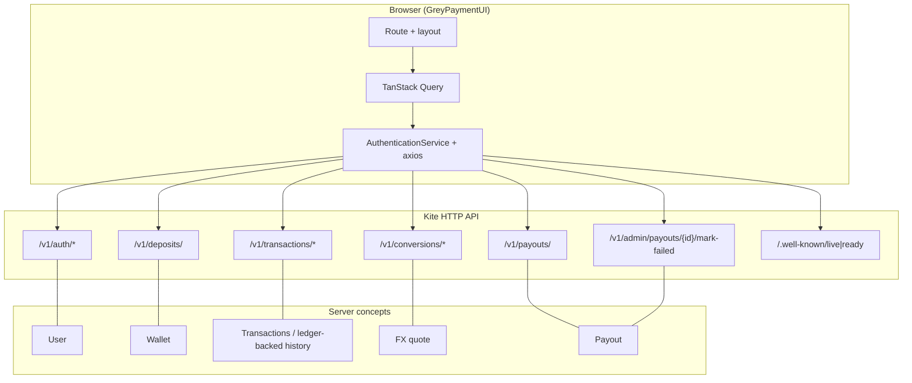

# GreyPaymentUI

React + TypeScript SPA for the **Kite** multi-currency wallet API: auth, deposits, FX quote/execute, payouts (including admin mark-failed), balances, and transaction history.

## 1. Architecture overview and key design decisions

**Stack:** React 19, TypeScript, Vite, React Router, TanStack Query, Axios.

**Structure**

- **Routing:** `react-router-dom` with a central route table (`src/routes/routeConfig.tsx`). Public: login, signup. Authenticated screens use `AppLayout` (navigation + shell).
- **Server state:** TanStack Query for queries/mutations (balances, transactions, deposits, conversions, payouts) for caching, loading/error handling, and cache invalidation after writes.
- **Auth:** API uses an **HttpOnly** session cookie. The UI does not store JWTs in `localStorage`. Axios uses **`withCredentials: true`** and **`Content-Type: application/json`** so cookies are sent on API requests.
- **HTTP layer:** `AuthenticationService` (`src/services/api.service.ts`) wraps REST calls; `axiosClient` (`src/services/axiosClient.ts`) sets base URL from **`VITE_API_URL`** (`src/env.ts`, default `http://localhost:8080`) and forwards **XSRF** when a cookie is present.

**Design decisions**

| Decision | Rationale |
|----------|-----------|
| Cookie + credentials | Matches backend HttpOnly session; reduces XSS exposure vs localStorage tokens. |
| TanStack Query | Clear patterns for async data, retries, and invalidating balances/history after mutations. |
| Single service for API paths | Keeps URLs and types in one place; pages stay thin. |
| `VITE_API_URL` | Standard Vite env; embedded at **build** time for static bundles. |
| FX quote → execute | Mirrors the API’s two-step contract and quote expiry. |
| Payout + admin on one page | Create payout and operator “mark failed” share one screen; mark-failed targets the last successful create in this session. |

## 2. How to run it

One command from this directory (Docker required):

```bash
docker compose up --build
```

Open **http://localhost:4173**. The API base URL in the built app defaults to **`http://localhost:8080`** (override with `VITE_API_URL` when building if your API differs).

**Local development (no Docker):**

```bash
npm install
npm run dev
```

Configure `VITE_API_URL` (e.g. in `.env`) so the browser can reach your Kite instance.

## 3. Data model / schema (Mermaid)

UI view of how the SPA talks to the API (not the database ERD).



## 4. HTTP endpoints (used by this UI)

Base URL: **`VITE_API_URL`**. All `/v1/...` routes expect the session cookie unless noted.

| Method | Path |
|--------|------|
| `POST` | `/v1/auth/signup` |
| `POST` | `/v1/auth/login` |
| `POST` | `/v1/auth/logout` |
| `GET` | `/v1/auth/current-user` |
| `POST` | `/v1/deposits/` |
| `POST` | `/v1/conversions/quote` |
| `POST` | `/v1/conversions/execute` |
| `POST` | `/v1/payouts/` |
| `POST` | `/v1/admin/payouts/{payout_id}/mark-failed` |
| `GET` | `/v1/transactions/balances/{currency_code}` |
| `GET` | `/v1/transactions/` |
| `GET` | `/.well-known/live` |
| `GET` | `/.well-known/ready` |

## Scripts

| Command | Description |
|---------|-------------|
| `npm run dev` | Vite dev server |
| `npm run build` | Typecheck + production build |
| `npm run preview` | Preview production build |
| `npm run lint` | ESLint |
