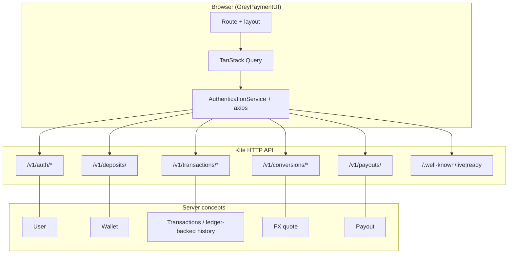

# GreyPaymentUI

**GreyPaymentUI** is the web front end for **Kite**: you can create an account, sign in, and work with a multi-currency wallet in one place. It’s for simulating how money moves in a product like this—funding the wallet, converting between currencies with a quote and a second “book it” step, and sending payouts to a bank account. You get a dashboard of balances, a single stream of transaction history, and on the payout page a way to follow a payout’s status as the server processes it.

The app is a single browser app that talks to the Kite API; you run the UI and the API together in development or use Docker for a one-command start of the static build (see below). The following sections describe how to run it, how the screen maps to the API, and the main technical choices.

## 1. Architecture overview and key design decisions

**Stack:** React 19, TypeScript, Vite, React Router, TanStack Query, Axios.

**Structure**

- **Routing:** `react-router-dom` with a central route table (`src/routes/routeConfig.tsx`). Public: login, signup. Authenticated screens use `AppLayout` (navigation + shell).
- **Server state:** TanStack Query for queries/mutations (balances, transactions, deposits, conversions, payouts) for caching, loading/error handling, and cache invalidation after writes.
- **Auth:** API uses an **HttpOnly** session cookie. The UI does not store JWTs in `localStorage`. Axios uses **`withCredentials: true`** and **`Content-Type: application/json`** so cookies are sent on API requests.
- **HTTP layer:** `AuthenticationService` (`src/services/api.service.ts`) wraps REST calls; `axiosClient` (`src/services/axiosClient.ts`) sets base URL from **`VITE_API_URL`** (`src/env.ts`, default `http://localhost:8080`) and forwards **XSRF** when a cookie is present.

**Design decisions**

| Decision | Rationale |
|----------|-----------|
| Cookie + credentials | Matches backend HttpOnly session; reduces XSS exposure vs localStorage tokens. |
| TanStack Query | Clear patterns for async data, retries, and invalidating balances/history after mutations. |
| Single service for API paths | Keeps URLs and types in one place; pages stay thin. |
| `VITE_API_URL` | Standard Vite env; embedded at **build** time for static bundles. |
| FX quote → execute | Mirrors the API’s two-step contract and quote expiry. |
| Payout flow | Payout is a standalone create flow from the UI. |

## 2. How to run it

### Option A — Docker (exact steps)

Use this if you want the UI running in a container and served by nginx.

Open a terminal in:

```bash
cd C:\Users\dolap\OneDrive\Desktop\GreyUI\GreyPaymentUI
```

Ensure Docker Desktop is running, then build + start:

```bash
docker compose up --build
```

Wait for logs showing container startup (you should see the web service started).

Open:

- UI: **http://localhost:4173**

Confirm backend URL used by UI build:

- Default is `VITE_API_URL=http://localhost:8080`
- So API should be reachable in browser at **http://localhost:8080**
- Quick health check: **http://localhost:8080/.well-known/live**

If your API is not on port 8080, set `VITE_API_URL` before building/running.

### Option B — Local development (Node + Vite)

Use this for faster iteration/hot reload.

Install dependencies:

```bash
npm install
```

Create `.env` (or `.env.local`) in `GreyPaymentUI` with:

```env
VITE_API_URL=http://localhost:8080
```

Run the dev server:

```bash
npm run dev
```

Open the local URL shown in terminal (usually **http://localhost:5173**).

Build locally (optional check):

```bash
npm run build
npm run preview
```

## 3. Data model / schema (Mermaid)

UI view of how the SPA talks to the API (not the database ERD).



## 4. HTTP endpoints (used by this UI)

Base URL: **`VITE_API_URL`**. All `/v1/...` routes expect the session cookie unless noted.

| Method | Path |
|--------|------|
| `POST` | `/v1/auth/signup` |
| `POST` | `/v1/auth/login` |
| `POST` | `/v1/auth/logout` |
| `GET` | `/v1/auth/current-user` |
| `POST` | `/v1/deposits/` |
| `POST` | `/v1/conversions/quote` |
| `POST` | `/v1/conversions/execute` |
| `POST` | `/v1/payouts/` |
| `GET` | `/v1/transactions/balances/{currency_code}` |
| `GET` | `/v1/transactions/` |
| `GET` | `/.well-known/live` |
| `GET` | `/.well-known/ready` |

## Scripts

| Command | Description |
|---------|-------------|
| `npm run dev` | Vite dev server |
| `npm run build` | Typecheck + production build |
| `npm run preview` | Preview production build |
| `npm run lint` | ESLint |
